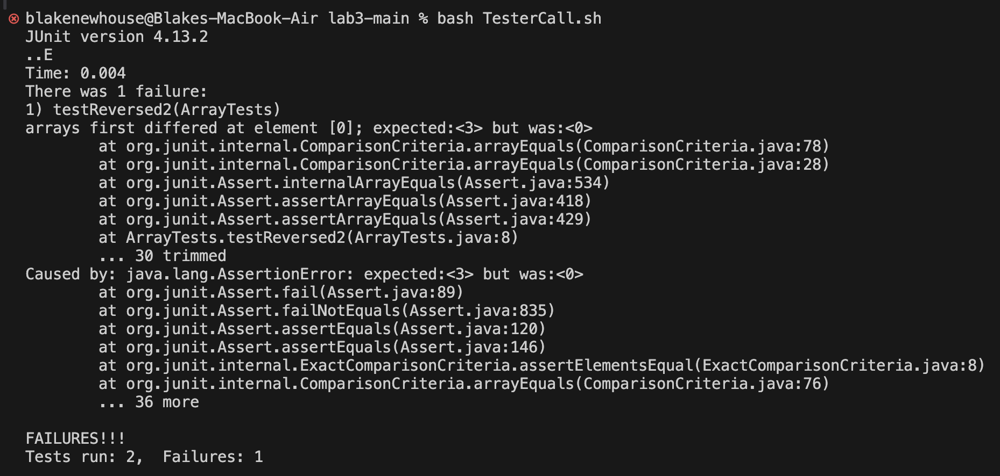

# Lab Report 3 <br/>
February 7, 2024 <br/>
Bugs and Commands: <br/>

With the Array Tests Lab from last week, we were tasked to find the Symptoms and Failure-Inducing Inputs within the ArrayExamples class. <br/>

The initial code that we were given for ArrayExamples was:
```
static int[] reversed(int[] arr) {
    int[] newArray = new int[arr.length];
    for(int i = 0; i < arr.length; i += 1) {
      arr[i] = newArray[arr.length - i - 1];
    }
    return arr;
  }
```
This code contains several bugs, and it is prevelent when we run the testers.

---

```
@Test
public void testReversed2() {
    int[] input1 = {1,2,3};
    assertArrayEquals(new int[]{3,2,1}, ArrayExamples.reversed(input1));
}
```
The test above produced an failure with the input, `{1,2,3}`. This is because the initial code(displayed above) overwrites the elements in the list and then copies the new elements from the overwritten
ones.

---

```
@Test
public void testReversed() {
    int[] input1 = { };
    assertArrayEquals(new int[]{ }, ArrayExamples.reversed(input1));
}
```
This test does not produce a falure because the input is an array with no elements, so the reveresed list is the same as the originial. The output will simply just be `{}`.

---

 <br/>

This is what gets returned when the tests are run, producing one successful test and one failed test.

---

Finally, this is the completed code that passes both tests without errors:

```
static int[] reversed(int[] arr) {
    int[] newArray = new int[arr.length];
    for(int i = 0; i < arr.length; i += 1) {
        newArray[i] = arr[i];
    }
    for(int i = 0; i < arr.length; i += 1) {
        arr[i] = newArray[arr.length - i - 1];
    }
    return arr;
}
```
In the code above, we changed the reversed method so that we make a copy of the original list, and reverse the elements from the copy onto the original list, and then return that reversed original list. This fixes the issue of using the overwritten list because it takes a copy of it and doesn't change that copy.

---

The command `less` is a command which will display the entire contents of a file on a seperate page, and it allows you to scroll though as if you were reading from a website. <br/>

```
less -N 1471-2431-2-1.txt
```
One option for a command line argument is `-N`, which will add line numbers onto the side of the file. This is extremely useful when using many other commands because it allows you to figure out which line you specifically need for other commands or methods. Below is an example output(I have only included the first 25 lines):
```
      1 
      2   
      3     
      4       
      5         Background
      6         Extensive bone marrow infiltration with cancer cells and
      7         anticancer therapy lead to immune incompetence in children
      8         with cancer [ 1 2 ] . Since the prognosis and overall
      9         survival of children with cancer have dramatically improved
     10         during past 30 years [ 3 ] , problems remain related to
     11         infections, mainly during leukopenic periods [ 3 4 5 ] .
     12         Causal pathogens of febrile neutropenia (FN), most
     13         frequently bacterial or fungal, are identified and
     14         confirmed by culture in 25-35% of the cases [ 3 6 ] . In
     15         other 15-25% of patients with FN, bacterial or fungal
     16         pathogens are suspected clinically. The remaining 50% of
     17         cases are classified as a fever of unknown origin (FUO) and
     18         may be caused by other pathogens, namely viruses, that are
     19         more difficult to detect by conventional diagnostic methods
     20         [ 7 8 9 ] .
     21         Lymphotropic herpesviruses (LH) Epstein-Barr virus
     22         (EBV), cytomegalovirus (CMV) and human herpesvirus-6
     23         (HHV-6) establish a lifelong persistent infection in a
     24         great majority of humans. They usually produce inaparent
     25         infection or transient immune compromise in otherwise
```
Here is another example, with a similar file, `ar104.txt`:
```
      1 
      2   
      3     
      4       
      5         Synopsis
      6         
      7           Introduction
      8           Rheumatoid arthritis (RA) is a chronic systemic
      9           autoimmune disease that is characterized by joint
     10           inflammation, and progressive cartilage and bone erosion.
     11           Recent research has identified certain biologic agents
     12           that appear more able than conventional therapies to halt
     13           effectively the progression of disease, as well as
     14           ameliorate disease symptoms. One potential problem with
     15           the use of biologic agents for arthritis therapy is the
     16           need for daily or weekly repeat dosing. The transfer of
     17           genes directly to the synovial lining can theoretically
     18           circumvent the need for repeat dosing and reduce
     19           potential systemic side effects [ 1, 2]. However,
     20           although many genes have been effective in treating
     21           murine CIA if administrated at a time before disease
     22           onset, local intra-articular or periarticular gene
     23           transfer has not been highly effective in halting the
     24           progression of established disease. IL-4, similar to
     25           tumor necrosis factor (TNF)-α and IL-1 inhibitors, has
```

---

```
less -i ar104.txt
```
Another option of a command line argument is `-i`, which will ignore capitalization when searching for elements within the file. This allows you to search for elements without anything being case sensitive, because it is rare for you to be looking for a specific case of a word. Additionally, while within a file using `less`, you can type `/<search query>` and the program will highlight each time the search query is mentioned in the program(I am using a screenshot here in order to show the highlighted words). <br/>

Using a search input of "`/mice`". This case is a showcase of the search function.


Using a search input of "`/disease`". This case makes it clear that "Disease" will still get found even though it is capitalized.


---

```
less +/<day> ar104.txt
```

The search function talked about previously can be used from the command line aswell. By using the argument `+/<search query>`, the file that you are reading will automatically highlight the words once you enter the file. This can allow you to easily locate different words and search for topics across the document.(I am using a screenshot here in order to show the highlighted words)<br/>

Using the command `less +/<day> ar104.txt` we get this:


In combination with the last one, we write the command line like so: `less -i +/<for> ar104.txt` and we get an output looking like this:


---

```
less +200 ar104.txt
```

Finally, the last command line argument is `+<line number>`. This command will take you to a certain line number, which is really helpful when traversing large files, so that you can jump to a line quickly. <br/>

These are the first 13 lines of output with the command `less +150 ar104.txt`:

```
        Introduction
        RA is a chronic systemic autoimmune disease that is
        characterized by joint inflammation, and progressive
        cartilage and bone erosion. Currently the symptoms of
        arthritis are managed using pharmacologic agents, including
        both steroidal and nonsteroidal drugs, and
        disease-modifying drugs such as methotrexate. No
        pharmacologic agents have yet proven effective in halting
        the progression of disease, however. Recent research has
        identified certain biologic agents that appear more able
        than conventional therapies to halt effectively the
        progression of disease, as well as ameliorate disease
        symptoms. In particular, inhibitors of TNF-α and IL-1 have
```

These are the first 13 lines of output with the command `less +400 ar104.txt`:

```
          after gene transfer to joints with established disease
          could effectively protect tissue from inflammation as
          well as block bone erosion. It is important to note that
          the possible inflammatory responses to adenoviral
          injection were examined by injection of the same number
          of particles of Ad-mIL-4 and Ad-eGFP into naïve joints of
          DBA mice. At the doses of virus used, however, no
          inflammation was observed (data not shown).
        
        
          Reduction in disease severity in noninjected front
          paws by local injection of IL-4
          Previously, we have noted a contralateral effect, in
```

All of these examples are from the  [less documentation website](https://man7.org/linux/man-pages/man1/grep.1.html).


