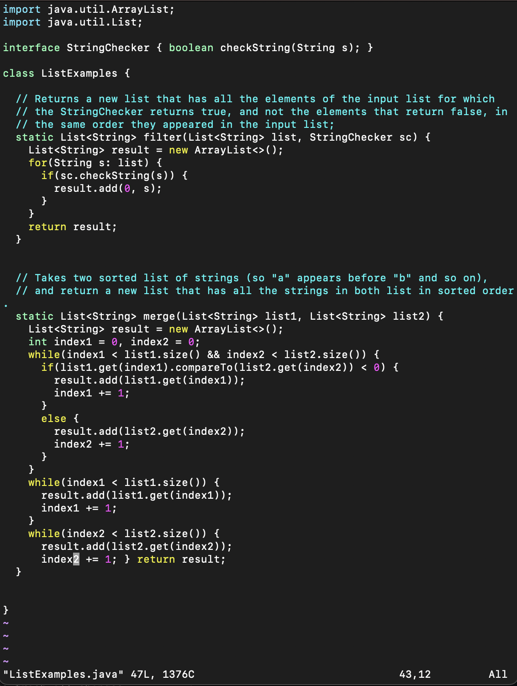

# Lab Report 4  
February 27, 2024  
Command Lin Usage:  

Speedrunning GitHub forks:

Keys Pressed: `ssh<space>blnewhouse@ieng6-201.ucsd.edu<enter>`  
First I logged onto my ieng6 machine using `ssh blnewhouse@ieng6-201.ucsd.edu`.   

  

Keys Pressed: `git<space>clone<ctrl>c<enter>`  
After that, I used `git clone` to create a clone of the GitHub repository from the lab, using an argument of `git@github.com:blakenewhouse/lab7again.git` that I copy pasted from GitHub.  

  

Once we have the clones repository, we need to enter the directory and run the program.  
Keys Pressed: `ls<enter> cd<space>la<tab><enter> ls<enter> bash<space>test.sh<enter>`  

  

This is not one of the steps, but for some reason the bash file I had contained an error, so I used vim to fix it.  
Keys Pressed: `vim<space>test.sh<enter> <down>89li<delete><delete><delete><delete><esc>ATests<esc>:wq<enter>`  

  

Now that we fixed that, we can run the program to find the actual error.  
Keys Pressed: `bash<space>test.sh<enter>`  

  

Now, we need to use `vim` to go and edit the code in the command line.  
Keys Pressed: `vim<space>List<tab>.java<enter> 42j12li<delete>2<esc>:wq<enter>`  

  

Now, we can run the tests and see that they all pass.  
Keys Pressed: `bash<space>test.sh`  

  
